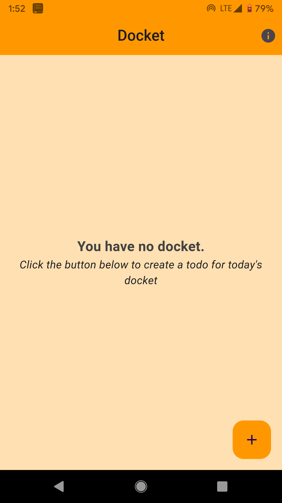
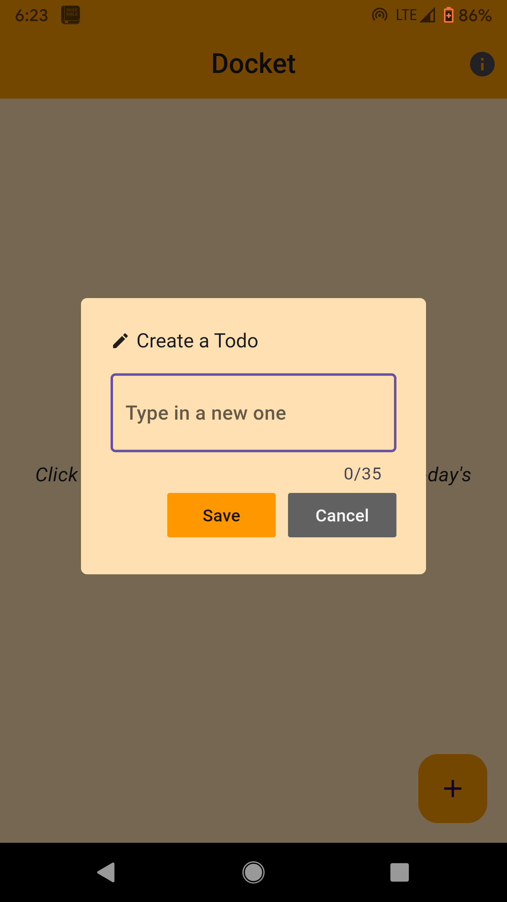
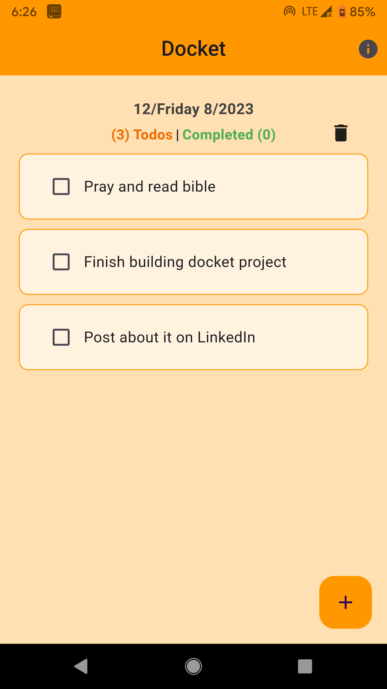
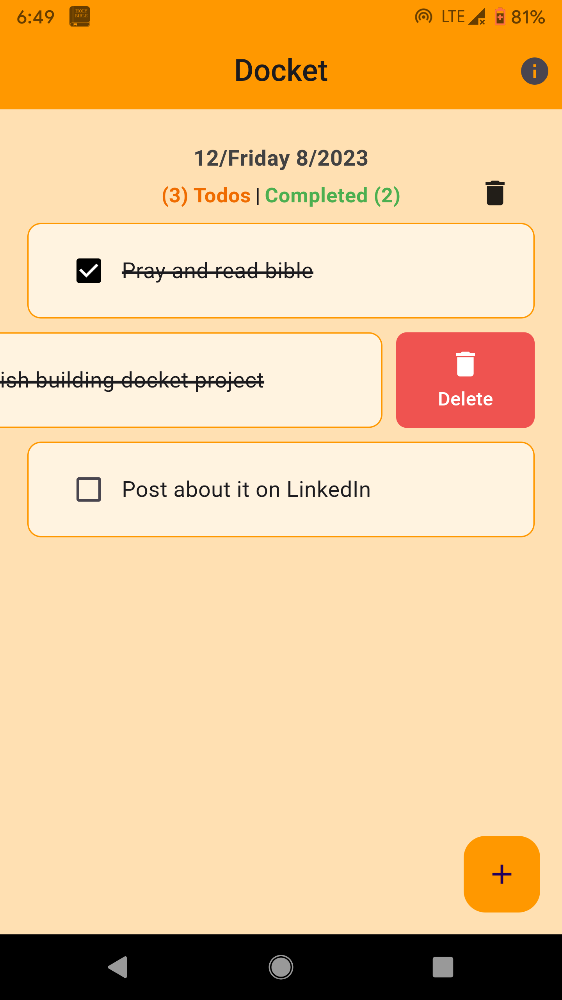

<br/>

[](https://github.com/naijadeveloper/docket/stargazers) [](https://www.linkedin.com/in/enoch-enujiugha-b12247112) [](https://naijadev.vercel.app/) [](https://www.buymeacoffee.com/mmejuenoch)

<br/>
<div align="center">
  <a href="https://github.com/naijadeveloper/Docket">
    
  </a>

  <h3 align="center">DOCKET</h3>

  <p align="center">
    A simple "Todo" productivity checker app!
    <br />
    <a href="https://github.com/naijadeveloper/Docket/issues">Report Bug</a>
    ·
    <a href="https://github.com/naijadeveloper/Docket/issues">Request Feature</a>
  </p>
</div>

<!-- TABLE OF CONTENTS -->
<details>
  <summary>Table of Contents</summary>
  <ol>
    <li>
      <a href="#about-the-project">About The Project</a>
      <ul>
        <li><a href="#built-with">Built With</a></li>
      </ul>
    </li>
    <li><a href="#usage">Usage</a></li>
    <li>
      <a href="#contributing">Contributing</a>
      <ul>
        <li><a href="#prerequisites">Prerequisites</a></li>
        <li><a href="#installation">Installation</a></li>
      </ul>
    </li>
    <!-- <li><a href="#license">License</a></li> -->
    <li><a href="#contact">Contact</a></li>
    <li><a href="#acknowledgments">Acknowledgments</a>
      <ul>
        <li><a href="#inspiration">Inspiration</a></li>
      </ul>
    </li>
  </ol>
</details>

<!-- ABOUT THE PROJECT -->

## About The Project

**Docket** = "_An agenda or list of things to be done._". For example, If someone asks you what's on your **docket** for the day, they really just want to know what you're doing today.
The app lets you create a docket each day, listing out all the actions you would like to do that day.

Having a list of all the things you plan to do for that day, helps you stay focused and more organised.✌🏾

### Built With

- [](https://docs.flutter.dev/)
- [](https://dart.dev/guides)

## Usage

<div style="display: flex; gap: 10px; flex-wrap: wrap; justify-content: center; align-items:center; align-content: start;">
  
  
  
  
</div>

## Contributing

Contributions are what make the open source community such an amazing place to learn, inspire, and create. Any contributions you make are **greatly appreciated**.

If you have a suggestion that would make this app better, please fork the repo and create a pull request. You can also simply open an issue with the tag "enhancement".
Don't forget to give the project a **star!** Thanks again!

1. Fork the Project
2. Clone project to local device
3. Create your Feature Branch (`git checkout -b feature/AmazingFeature`)
4. Commit your Changes (`git commit -m 'Add some AmazingFeature'`)
5. Push to the Branch (`git push origin feature/AmazingFeature`)
6. Open a Pull Request

### Prerequisites

- [flutter sdk](https://docs.flutter.dev/get-started/install)
- [Android studio & sdk](https://developer.android.com/studio)
- [Vs code](https://code.visualstudio.com/download) _optional_
  Don't forget to install the **dart** and **flutter** extensions in vs code. I also found the **Error lens** extension very useful

### Installation

After cloning project to your local device, you would want to run in terminal

```sh
flutter pub get
```

## Contact

- [Twitter@naijadeveloper](https://twitter.com/naijadeveloper)

- [LinkedIn@enochenujiugha](https://www.linkedin.com/in/enoch-enujiugha-b12247112)

- [Portfolio](https://naijadev.vercel.app/)

- mmejuenoch@gmail.com / naijadeveloper@gmail.com

<!-- Android play store link and Ios store link -->

## Acknowledgments

- [Flutter_slidable](https://pub.dev/packages/flutter_slidable)
- [Hive & Hive_flutter & Hive_generator](https://pub.dev/packages/hive)
- [Riverpod](https://riverpod.dev/docs/introduction/why_riverpod)
- [Url_launcher](https://pub.dev/packages/url_launcher)
- [Flutter_launcher_icons](https://pub.dev/packages/flutter_launcher_icons)
- [Flutter_native_splash](https://pub.dev/packages/flutter_native_splash)
- [Img Shields](https://shields.io)
- [Icons8](https://icons8.com/)
- [Google fonts](https://fonts.google.com/)
- [README Template](https://github.com/othneildrew/Best-README-Template)

### Inspiration

- [Mitch koko's full flutter beginner youtube tutorial](https://www.youtube.com/watch?v=HQ_ytw58tC4)
