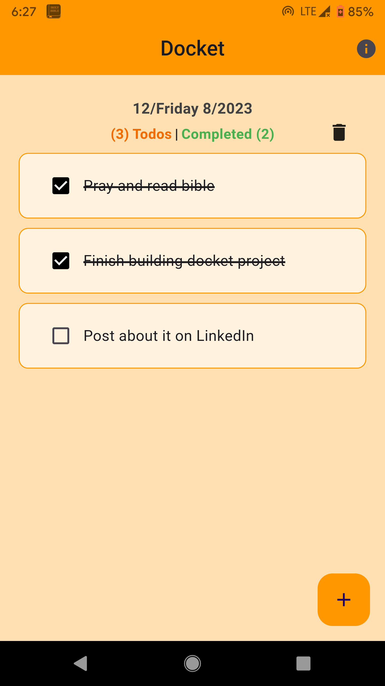

<!-- PROJECT LOGO -->
 

<!--
*** I'm using markdown "reference style" links for readability.
*** Reference links are enclosed in brackets [ ] instead of parentheses ( ).
*** See the bottom of this document for the declaration of the reference variables
*** for buy me a coffee url
-->

 

  

  <h3 align="center">DOCKET</h3>

  

    A simple "Todo" productivity checker app!
     
    <a href="https://github.com/naijadeveloper/Docket/issues">Report Bug</a>
    ·
    <a href="https://github.com/naijadeveloper/Docket/issues">Request Feature</a>
  

<!-- TABLE OF CONTENTS -->

  
Table of Contents

  <ol>
    <li>
      <a href="#about-the-project">About The Project</a>
      <ul>
        <li><a href="#built-with">Built With</a></li>
      </ul>
    </li>
    <li><a href="#usage">Usage</a></li>
    <li>
      <a href="#contributing">Contributing</a>
      <ul>
        <li><a href="#prerequisites">Prerequisites</a></li>
        <li><a href="#installation">Installation</a></li>
      </ul>
    </li>
    <!-- <li><a href="#license">License</a></li> -->
    <li><a href="#contact">Contact</a></li>
    <li><a href="#acknowledgments">Acknowledgments</a></li>
  </ol>

<!-- ABOUT THE PROJECT -->

## About The Project

<i style='color:seagreen'>Docket =</i> "_An agenda or list of things to be done._". For example, If someone asks you what's on your <strong>docket</strong> for the day, they really just want to know what you're doing today.
The app lets you create a docket each day, listing out all the actions you would like to do that day.

Having a list of all the things you plan to do for that day, helps you stay focused and more organised.✌🏾

### Built With

## Usage

  
  
  
  
  

[flutter-shield]: https://img.shields.io/badge/flutter-2F75D8?style=for-the-badge&logo=flutter&logoColor=white
[flutter-url]: https://docs.flutter.dev/
[dart-shield]: https://img.shields.io/badge/dart-132030?style=for-the-badge&logo=dart&logoColor=white
[dart-url]: https://dart.dev/guides
